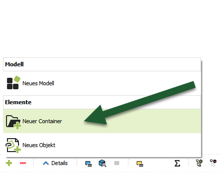
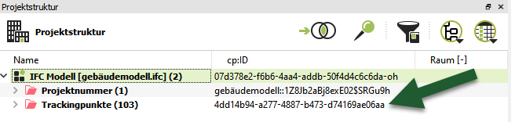
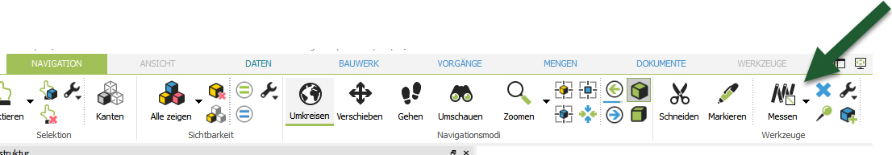
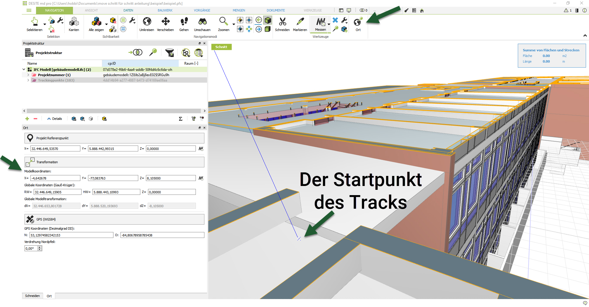
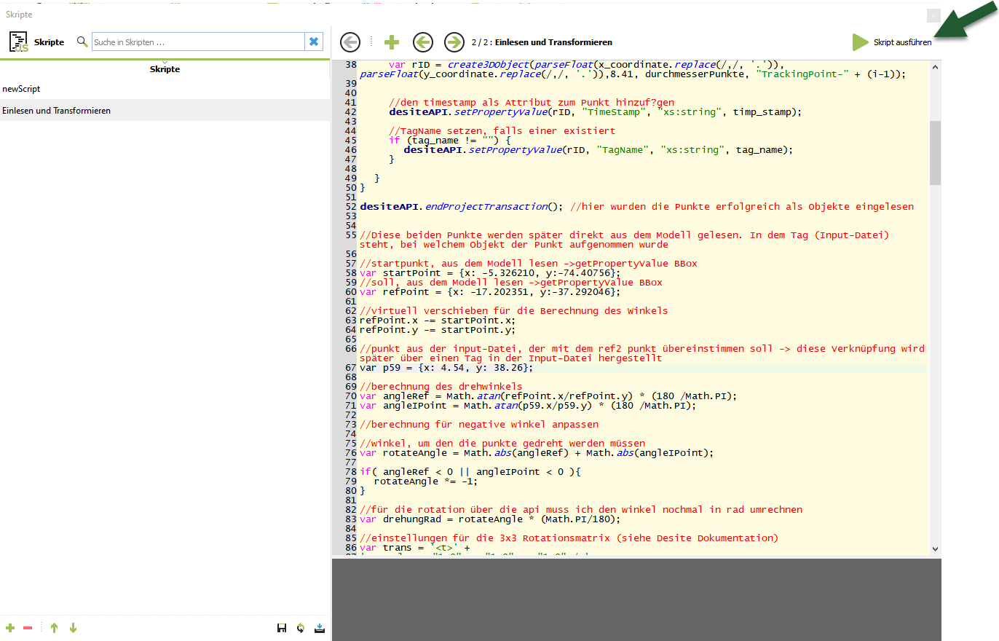
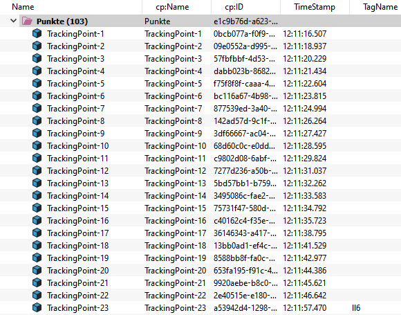
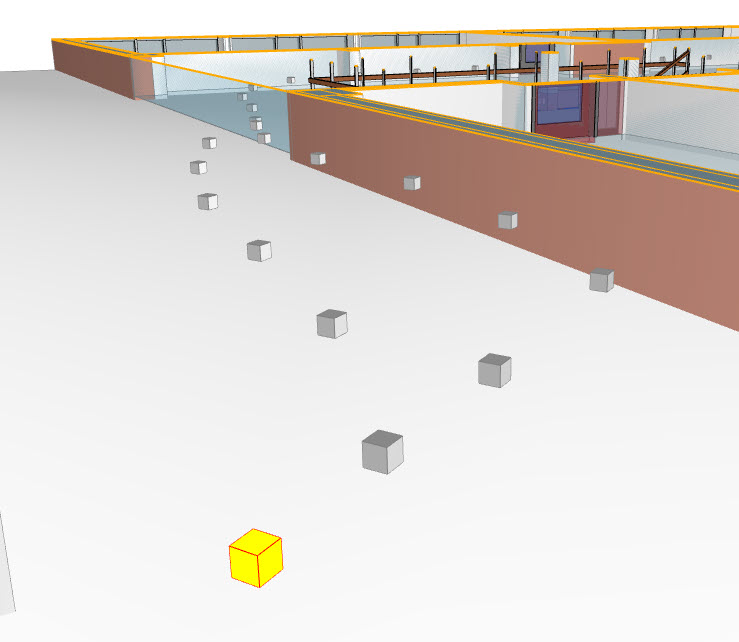
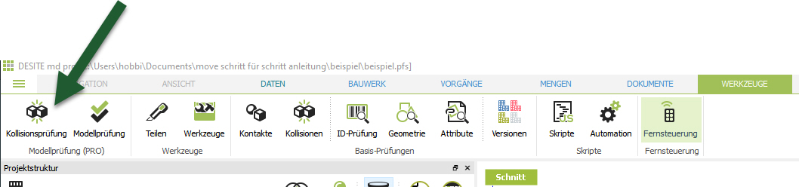
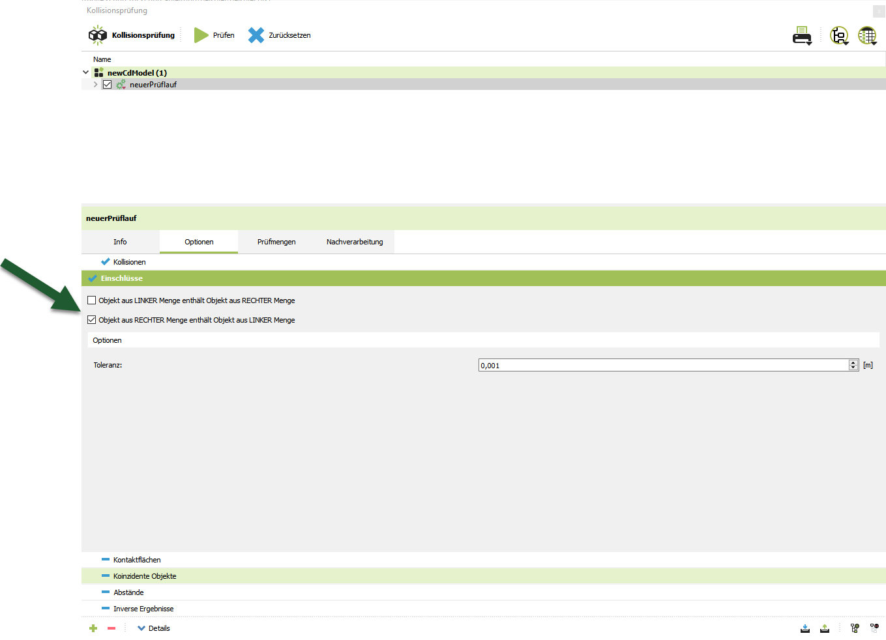
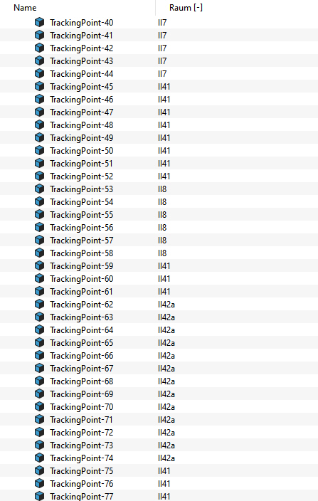

# Interaktion zwischen einem Gebäudedatenmodell und einer verorteten Gebäudebegehung

Dieser Beitrag beschreibt die Überlagerung eines Gebäudeinformationsmodells (BIM) mit Informationen aus einer Gebäudebegehung und den dabei aufgenommenen Informationen wie Bildern oder Kommentaren. Die Daten aus dem Bewegungspfad werden mit einem autonomen Innenraum Positionierungssystem (Indoor Position System bzw. IPS) erzeugt.  Die Informationen aus dem Bewegungspfad werden automatisch den Räumen aus einem Industrial Fundation Class (IFC) Modell zugeordnet. Die vorgestellte Anwendung bietet einen offenen BIM-Ansatz für eine robuste und effiziente Datenüberlagerung. Der Ansatz kann ebenfalls für eine Echtzeit-Lokalisierung bzw. Simultaneous Localization and Mapping (SLAM) auf einem mobilen Endgerät verwendet werden.

## Beispiel Workflow ansehen

[](https://youtu.be/i-E0W5LkjS8 "Besipiel Workflow Youtube")

> Für dieses Beispiel wird DESITE MD Version 2.6.1 verwendet.
> 
### Vorbereitung

Die Daten des Trackers liegen als Textdatei **(siehe punkte-testdaten.txt)** vor. Diese Datei wird in dem Ordner des dazugehörigen Projektes abgelegt.

### Schritt 1 - Container für Trackingpunkte anlegen
Einen Container anlegen, in dem die Trackingpunkte später gespeichert werden.

### Schritt 2 - cp:ID des Containers kopieren
Einen Container anlegen, in dem die Trackingpunkte später gespeichert werden.

### Schritt 3 - Das Skript (readAndTransform.js) importieren
Skripte aufrufen


Das Skript **readAndTransform.js** importieren


### Schritt 4 - cp:ID des Containers in Skript einfügen
In den Zeilen 7 und 94 des Skriptes muss die cp:ID des Containers aus Schritt 2 eingefügt werden.

``` JS
//Zeile 7
var containerID = "e1c9b76d-a623-423e-b98b-630647948f0c";

//Zeile 94
var pList = desiteAPI.getContainedElements("4dd14b94-a277-4887-b473-d74169ae06aa",0,false);
```

### Schritt 5 - Referenzpunkte aus Modell ablesen
Als nächstes werden zwei Referenzpunkte aus dem abgelesen. Dafür wird die Funktion "Messen" verwendet.



Der erste Referenzpunkt ist der Start des Tracks, der abgelaufen wurde. Über die Funktion "Orte" können die Modellkoordinaten ausgelesen werden. Diese werden im nächsten Schritt in das Skript eingefügt.



### Schritt 6 - Startpunkt in Skript eintragen
In der Zeile 58 des Skriptes werden jetzt die gemessenen Punkte aus dem vorherigen Schritt eingetragen.

``` JS
//Zeile 58
var startPoint = {x: -5.326210, y:-74.40756};
```

### Schritt 7 - Weiteren Referenzpunkt bestimmen
Als nächstes wird ein weiterer Referenzpunkt bestimmt. Dies ist ein Punkt im Modell, der während des Tracks abgelaufen wurde. Nach dem Auslesen der Modellkoordinaten (siehe Schritt 5 u. Schritt 6) wird der zweite Referenzpunkt in Zeile 60 des Skriptes eingetragen.

``` JS
//Zeile 60
var refPoint = {x: -17.202351, y:-37.292046};
```

### Schritt 8 - Übereinstimmenden Punkt aus Txt-Datei eintragen
Der in Schritt 7 hinzugefügte Referenzpunkt entspricht einem Punkt in der punkte-testdaten.txt Datei. In diesem Besipiel handelt es sich um den Messpunkt 59. Die Koordinaten werden in das Skript in Zeile 67 eingetragen.
``` JS
//Zeile 67
var p59 = {x: 4.54, y: 38.26};
```
### Schritt 9 - Skript ausführen
Das Skript kann jetzt ausgeführt werden.

Daraufhin wird für jeden Punkt des Tracks ein Objekt in dem angelegten Container angelegt. Zusätzlich werden den Objekten der Timestamp und die Tagnamen als Attribute angehängt.





## Den Punktobjekten die Räume zuordnen

Über die Funktion Kollionsprüfung werden den einzelnen Punktobjekten die Raumnamen als Attribute hinzugefügt.



### Schritt 1 - Prüflauf anlegen
In dem neuen Dialog wird zuerst ein neues "Modell" angelegt. Zu dem Modell wird ein dazugehöriger "Prüflauf" angelegt.


### Schritt 2 - Option Einschlüsse aktivieren
In den Optionen -> Einschlüsse des Prüflaufs wird die Option "Objekt aus RECHTER Menge enthält Objekt aus LINKER Menge" ausgewählt.



### Schritt 3 - Prüfmengen festlegen
Unter "Prüfmengen" werden die Trackingpunkte und die Räume ausgewählt. Die Trackingpunkte können per Drag and Drop zu der linken Prüfmenge hinzugefügt werden.


Für die rechte Prüfmenge werden die IfcSpaces des Modells ausgewählt. Diese können über den Filter hinzugefügt werden.


### Schritt 4 - Skript einfügen
Als letztes wird bei dem Punkt "Nachbearbeitung" das folgende Skript eingefügt:
``` JS
//name des raumes auslesen
var strRaumName = desiteAPI.getPropertyValue(desiteRight.ID(),"bs:SectionName","xs:string")
//den raumnamen in dem punkt aktualisieren
desiteAPI.setPropertyValue(desiteLeft.ID(),"Raum","xs:string",strRaumName);
```
### Schritt 5 - Prüflauf starten
Jetzt kann der Prüflauf ausgeführt werden.


Wenn es eine Überschneidung von einem Punktobjekt und einem Raum gibt, wird der Name des Raums als Attribut des Punktes hizugefügt.


