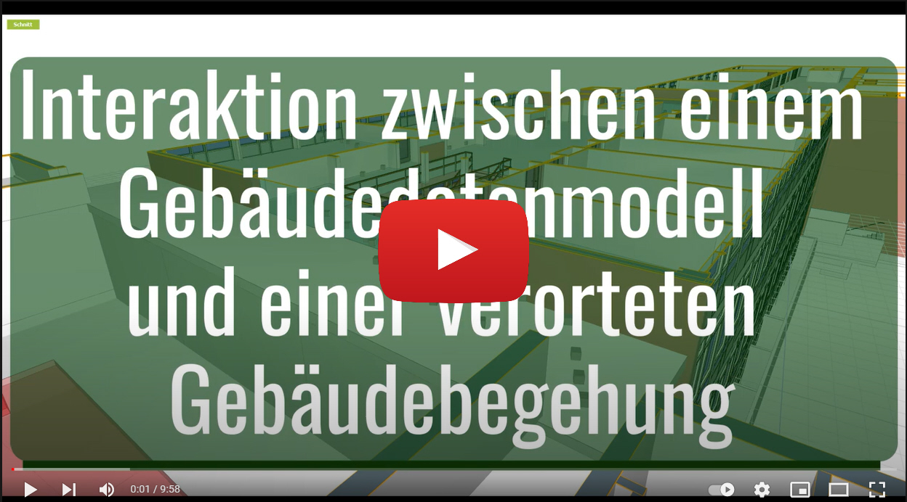

# Interaktion zwischen einem Gebäudedatenmodell und einer verorteten Gebäudebegehung

Dieser Beitrag beschreibt die Überlagerung eines Gebäudeinformationsmodells (BIM) mit Informationen aus einer Gebäudebegehung und den dabei aufgenommenen Informationen wie Bildern oder Kommentaren. Die Daten aus dem Bewegungspfad werden mit einem autonomen Innenraum Positionierungssystem (Indoor Position System bzw. IPS) erzeugt.  Die Informationen aus dem Bewegungspfad werden automatisch den Räumen aus einem Industrial Fundation Class (IFC) Modell zugeordnet. Die vorgestellte Anwendung bietet einen offenen BIM-Ansatz für eine robuste und effiziente Datenüberlagerung. Der Ansatz kann ebenfalls für eine Echtzeit-Lokalisierung bzw. Simultaneous Localization and Mapping (SLAM) auf einem mobilen Endgerät verwendet werden.

## Beispiel Workflow ansehen

[](https://youtu.be/i-E0W5LkjS8 "Besipiel Workflow Youtube")

> Für dieses Beispiel wird DESITE MD Version 2.6.1 verwendet.
> 
### Vorbereitung

Die Daten des Trackers liegen als Textdatei **(siehe punkte-testdaten.txt)** vor. Diese Datei wird in dem Ordner des dazugehörigen Projektes abgelegt.

### Schritt 1 - Container für Trackingpunkte anlegen
Einen Container anlegen, in dem die Trackingpunkte später gespeichert werden.

### Schritt 2 - cp:ID des Containers kopieren
Einen Container anlegen, in dem die Trackingpunkte später gespeichert werden.

### Schritt 3 - Das Skript (readAndTransform.js) importieren
Skripte aufrufen


Das Skript **readAndTransform.js** importieren


``` JS
//durchmesser der Punkte/Objekte in Meter
var durchmesserPunkte = 0.1;

//container, in dem die Punkte gespeichert werden
var containerID = "e1c9b76d-a623-423e-b98b-630647948f0c";

//inhalt der textdatei einlesen
var lineList = desiteAPI.readTextFile(desiteAPI.getProjectDirectory() + '/punkte-testdaten.txt');
```

Schließlich werden die Koordinaten zweier Refernzepunkte angegeben, die als Basis der Translation verwendet werden.

``` JS
//startpunkt, aus dem Modell lesen ->getPropertyValue BBox
var startPoint = {x: -5.326210, y:-74.40756};
//soll, aus dem Modell lesen ->getPropertyValue BBox
var refPoint = {x: -17.202351, y:-37.292046};
```

Das Skript legt für jeden Punkt in der Textdatei ein Objekt innerhalb des Containers an und fügt als Attribute den Timestamp und den Namen des Tags hinzu.


Auf Basis der Referenzpunkte erfolgt die Translation der Objekte auf die korrekte Positio im Modell.


Über die Kollionsprüfung von Desite werden die Räume ausgelesen, in denen sich die Objekte befinden. Dafür werden zwei Prüfmengen benötigt. 

1. Prüfmenge -> Die erzeugten Punktobjekte
2. Prüfmenge -> IFC Space Entities der IFC (Über einen Filter ausgewählt)


Wenn es eine Überschneidung von einem Punktobjekt und einem Raum gibt, wird der Name des Raums als Attribut des Punktes hizugefügt.

``` JS
//name des raumes auslesen
var strRaumName = desiteAPI.getPropertyValue(desiteRight.ID(),"bs:SectionName","xs:string")
//den raumnamen in dem punkt aktualisieren
desiteAPI.setPropertyValue(desiteLeft.ID(),"Raum","xs:string",strRaumName);
```


## Bilder zuordnen (assignImages.js)
Während der Begehung werden Bilder gemacht, deren Aufnahmezeit in die Dateinamen der Bilder geschrieben wird. 

``` JS
JPEG_20200708_121238_2048566100.jpg
```

Über den Timestamp der Punktobjekte können die Bilder als Attribute an die Punkte angehängt werden. Als Attribut wird der Pfad des Bildes verwendet.
