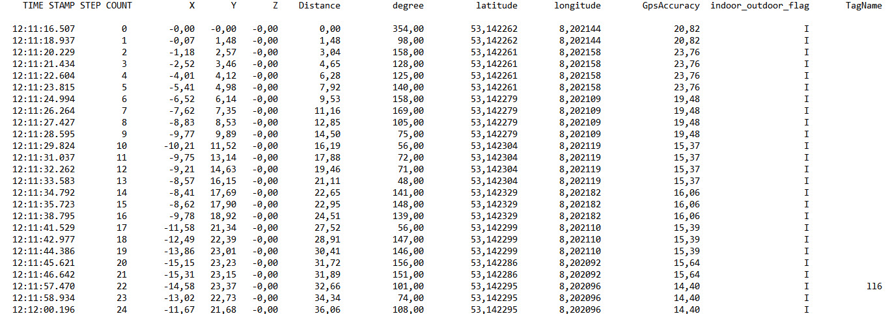

# Interaktion zwischen einem Gebäudedatenmodell und einer verorteten Gebäudebegehung

Die Daten des Trackers liegen als Textdatei (punkte-testdaten.txt) vor. Diese Datei muss in dem Ordner des dazugehörigen Desite-Projektes gespeichert werden.


Als nächstes wird ein Container in Desite angelegt, in dem die Punkte später gespeichert werden. Die cp:ID des Containers wird in das Skript übernommen.

Vor der Ausführung des Skriptes kann der Durchmesser der Punkte, die ID des Containers und der Pfad zu der Textdatei mit den Daten des Trackers angepasst werden.

``` JS
//durchmesser der Punkte/Objekte in Meter
var durchmesserPunkte = 0.1;

//container, in dem die Punkte gespeichert werden
var containerID = "e1c9b76d-a623-423e-b98b-630647948f0c";

//inhalt der textdatei einlesen
var lineList = desiteAPI.readTextFile(desiteAPI.getProjectDirectory() + '/punkte-testdaten.txt');
```

Schließlich werden die Koordinaten zweier Refernzepunkte angegeben, die als Basis der Translation verwendet werden.

``` JS
//startpunkt, aus dem Modell lesen ->getPropertyValue BBox
var startPoint = {x: -5.326210, y:-74.40756};
//soll, aus dem Modell lesen ->getPropertyValue BBox
var refPoint = {x: -17.202351, y:-37.292046};
```

Das Skript legt für jeden Punkt in der Textdatei ein Objekt innerhalb des Containers an und fügt als Attribute den Timestamp und den Namen des Tags hinzu.


Auf Basis der Referenzpunkte erfolgt die Translation der Objekte auf die korrekte Positio im Modell.


Über die Kollionsprüfung von Desite werden die Räume ausgelesen, in denen sich die Objekte befinden. Dafür werden zwei Prüfmengen benötigt. 

1. Prüfmenge -> Die erzeugten Punktobjekte
2. Prüfmenge -> Die Räume des IFC-Modell

Wenn es eine Überschneidung von einem Punktobjekt und einem Raum gibt, wird der Name des Raums als Attribut des Punktes hizugefügt.

``` JS
//name des raumes auslesen
var strRaumName = desiteAPI.getPropertyValue(desiteRight.ID(),"bs:SectionName","xs:string")
//den raumnamen in dem punkt aktualisieren
desiteAPI.setPropertyValue(desiteLeft.ID(),"Raum","xs:string",strRaumName);
```

## Bilder zuordnen (assignImages.js)
Während der Begehung werden Bilder gemacht, deren Aufnahmezeit in die Dateinamen der Bilder geschrieben wird. Über den Timestamp der Punktobjekte können die Bilder als Attribute an die Punkte angehängt werden. Als Attribut wird der Pfad des Bildes verwendet.
